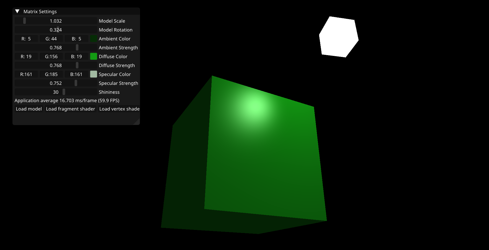
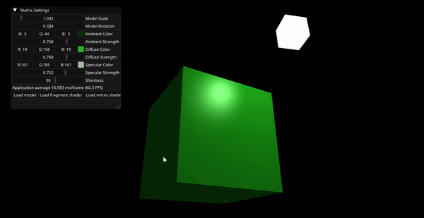
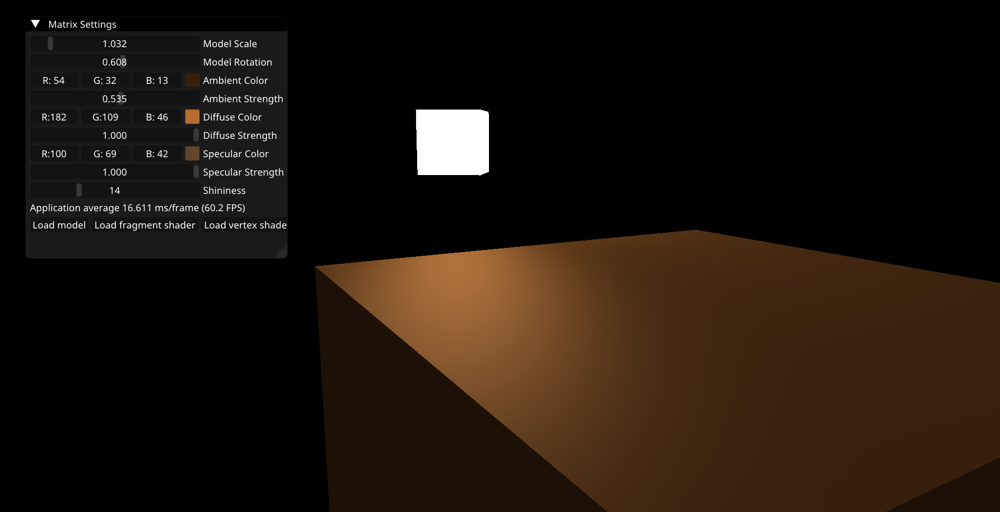
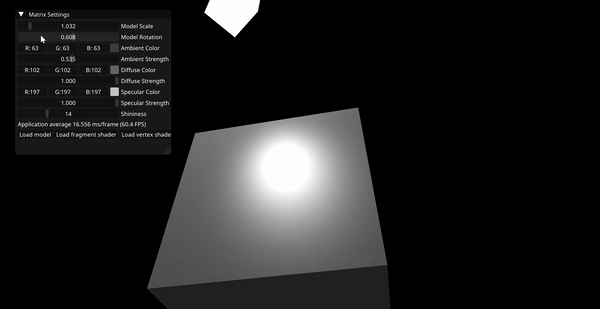

# OpenGLStarter

A starter repository for a 3D OpenGL project in C++

## Features

- Camera movement

- Phong Material shading

- Real time material editing

- Live Shader recompiling
- Live model loading
